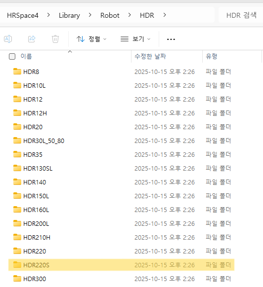
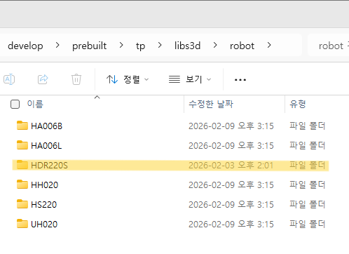
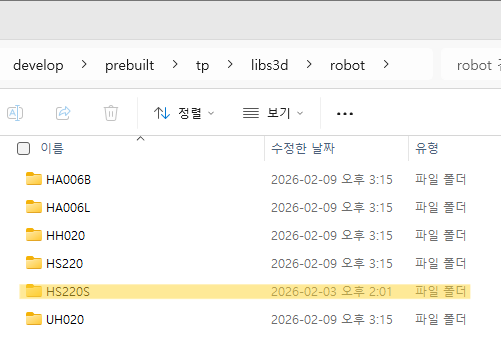

# 注册新的机器人模型

****

1. 从 HRSpace 安装目录中的库中找到机器人建模文件，复制您想使用的机器人模型的文件夹。
* 文件路径：[HRSpace(version)\Library\Robot]

2. 将复制的文件夹添加到控制器的机器人 3D 文件存储目录。
* 文件路径：[prebuilt\tp\libs3d\robot]

3. 如果包含机器人 3D 文件的文件夹名称对应于旧版本， 将其重命名为新版本。

****

* 示例：添加新的 HS220S 机器人模型

1) 从存储在库中的机器人建模文件中复制 HS220S 机器人建模文件。

</img>
<em>
检查要添加的机器人建模文件的位置并复制它
</em>

2) 将复制的文件夹保存到控制器的机器人 3D 文件存储目录。

</img>
<em>
将复制的文件夹粘贴到控制器的机器人 3D 文件存储目录
</em>

3) 将文件夹名称更改为新版本。

</img>
<em>
如果机器人建模文件夹名称对应于旧版本，请将文件夹重命名
</em>

